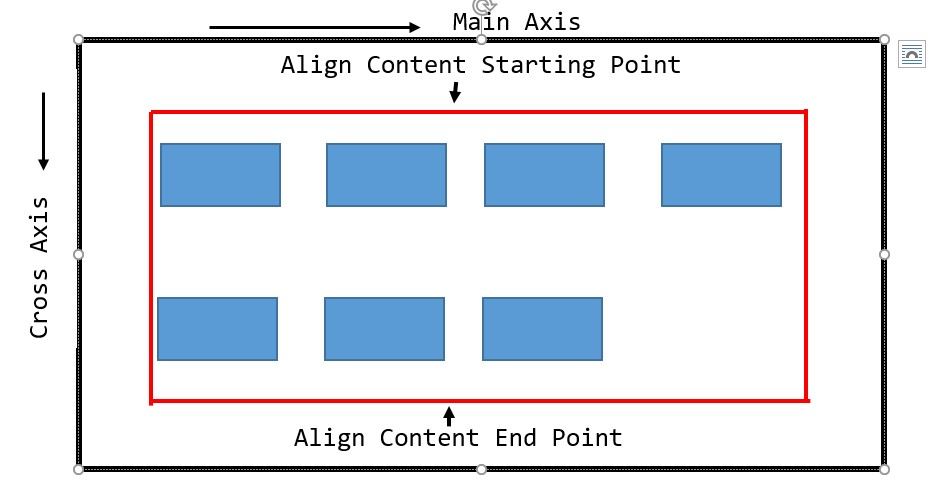
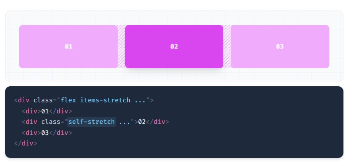

# Flex Layout
## Flex Property: 
There are two kind of flex property:  
### Flex Container Property:
•	flex-direction  
•	flex-wrap  
•	flex-flow  
•	justify-content  
•	align-items  
•	align-content  
### Flex Items Property:
•	order  
•	flex-grow  
•	flex-shrink  
•	flex-basis  
•	flex  
•	align-self  

## Flexbox Axis:
1. Main-axis -> এই এক্সিস বরাবর আইটেম সমূহ মোভ করে যখন flex ঘেষণা করা হয়। বাই ডিফল্ট ইহা বাম থেকে ডানে কাজ করে।
2. Cross-axis -> এই এক্সিস বরাবর আইটেম সমূহ এ্যালাইন হয়। বাই ডিফল্ট ইহা উপর থেকে নিচের দিকে কাজ করে। 

# Flex-Direction
## flex-row	

## flex-row-reverse	

## flex-col	

## flex-col-reverse

# Flex-wrap
## flex-nowrap

## flex-wrap

## flex-wrap-reverse

# What is content?

# What is Items?

# Justify content
## justify-start

## justify-end	

## justify-center

## justify-between

## justify-around
- Start point to items gap + End point to items gap == items to items gap.

## justify-evenly
- Start point to items gap == End point to items gap == items to items gap.

# Align Item
ইহা ক্রস এক্সিস বরাবর কাজ করে। তাই কন্টেইনারের হাইট নির্ধারণ না করলে ইহা কাজ করবেনা। কন্টেইনারের হাইটকে প্রত্যেকটি আইটেম সমান ভাবে ভাগ করে যার যার এরিয়া তৈরী করে।   
## items-start
	

## items-end

## items-center	

## items-baseline

## items-stretch

# Align Content
## content-center

## content-start

## content-end	

## content-between

## content-around 
- Start point to items gap + End point to items gap == items to items gap.

## content-evenly 
- Start point to items gap == End point to items gap == items to items gap.

# Align Self
## self-start

## self-end	

## self-center

## self-stretch	

# Grow
Grow মানে হল বৃদ্ধি হওয়া। বাই ডিফল্ট তার মান ০; অর্থাৎ সে বৃদ্ধি হবেনা। আইটেমস এর যে যে আইটেমের মধ্যে grow ব্যবহার করা হবে সে আইটেমগুলো বৃদ্ধি হয়ে  মেইন এক্সিস বরাবর কন্টেইনারের বাকি জায়গাটুকু দখল করবে।   
grow       -> 	flex-grow: 1;  
grow-0     -> 	flex-grow: 0;  

## Example

# Shrink
Shrink মানে হল সংকুচিত হওয়া। বাই ডিফল্ট তার মান ১; অর্থাৎ সে সংকুচিত হবে।  আইটেমস এর যে যে আইটেমের মধ্যে Shrink:০ ব্যবহার করা হবে সে আইটেমগুলো সংকুচিত হবেনা।  
shrink       ->	flex-shrink: 1;  
shrink-0    ->	flex-shrink: 0;  
## Shrink

## Don't Shrink

# basis
এর মাধ্যমে আইটেমের প্রাথমিক সাইজ নির্ধারণ করা হয়।

# Order
এর মাধ্যমে আইটেম যে অবস্থানে থাকুক সে অবস্থান অন্যত্র তার অবস্থান নির্ণয় করা যায।

