# Grid Layout
# Specifying the column in a grid
 grid-cols-{n} এর মাধ্যমে একটি কন্টেইনারের কন্টেন্টগুলোকে সমান সাইজের কলামে ভাগ করা যায়।  
 - প্রত্যেকটি কন্টেন্টকে বাম থেকে ডানে নিয়ে প্রথম রোতে নির্ধারিত কলাম তৈরী করবে, পরে যদি কন্টেন্ট বেশি হয় তাহলে আবার নিচের রো থেকে কলাম তৈরী করবে।
 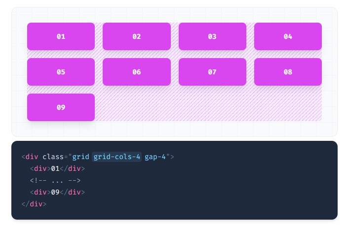
 # Spanning columns
col-span-{n} এর মাধ্যমে কলামকে বৃদ্ধি করা যায়।  
 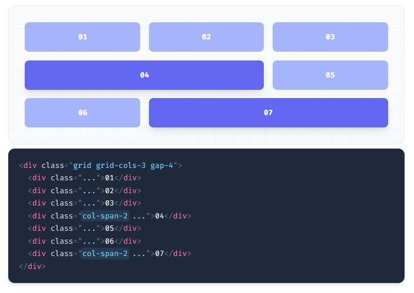
 # Starting and ending columns
 col-start-{n} and col-end-{n} এর মাধ্যমে কলাম এর শুরু এবং শেষ নির্ধারণ করা যায়। কলামের হিসাব শুরু হবে ১ থেকে এবং শেষ হবে শেষ নাম্বারের আগের নাম্বারে।    
 -  নিচে ১ নং কলামটি ২ নং কলাম থেকে শুরু হয়ে ২নং এ শেষ হয়েছে ফলে শুধু একটি কলামই নিয়েছে এবং ১ নং কলামটি গ্যাপ রয়ে গিয়েছে।
 - ২ নং কলামটি ঐ রো এর ১ নং কলাম থেকে শুরু হয়ে ৩ নং কলাম পর্যন্ত নিয়েছে ফলে সে দুইটি কলাম দখল করছে। 
 - ৪ নং কলামটির শেষ হবে ৪ নং কলামে, যেহেতু শুরু বলা হয়নি তাই সে শুরুর  কলামগুলো খালি রেখে ৩ নং কলামে সরে গিয়েছে।
 - ৫নং কলামটি ১ থেকে ৩ পর্যন্ত পুরো কলামটি দখল করেছে। 
  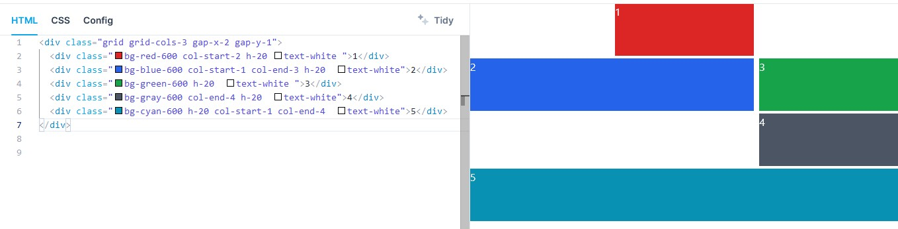

  # Specifying the rows in a grid
 grid-rows-{n} এর মাধ্যমে একটি কন্টেইনারের কন্টেন্টগুলোকে সমান সাইজের রোতে ভাগ করা যায়।  
 - প্রত্যেকটি কন্টেন্টকে উপর থেকে নিচে নিয়ে প্রথম কলামে নির্ধারিত রো তৈরী করবে, পরে যদি কন্টেন্ট বেশি হয় তাহলে আবার ডানের কলাম থেকে রো তৈরী করবে। অর্থাৎ সে প্রথম কলাম থেকে শুরু করবে যখন ওভারফ্লো হবে তখন ২য় কলাম থেকে শুরু হবে। যেমনঃ ৪ টি রো নির্ধারণ করার কারণে প্রথমে কলামে ৪ টি রো তৈরী হওয়ার পর ২য় কলামে ৫ থেকে রো তৈরী করছে। 

 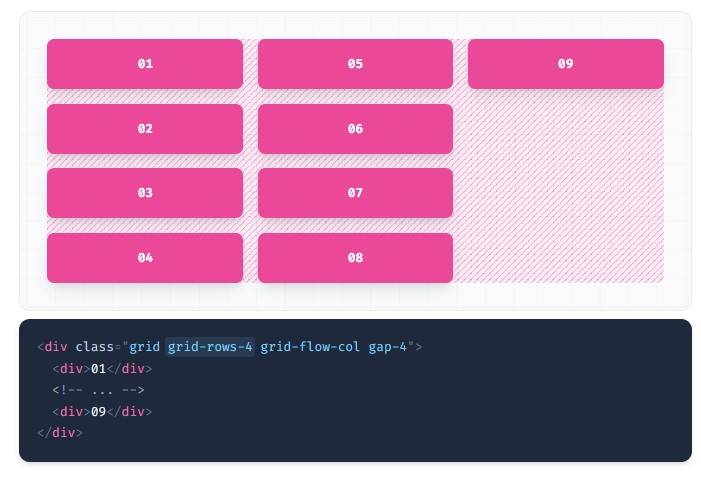

 # Spanning rows
 row-span-{n} এর মাধ্যমে rows বৃদ্ধি করা যায়।    
 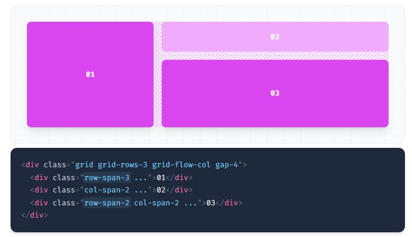

 # Starting and ending rows
 row-start-{n} and row-end-{n} এর মাধ্যমে row এর শুরু এবং শেষ নির্ধারণ করা যায়।  
 

 # Setting the gap between elements
 ## Syntax: gap-{size}

 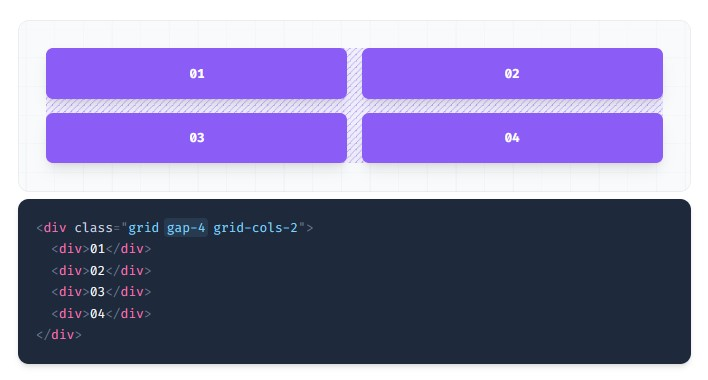

# What is item in grid layout
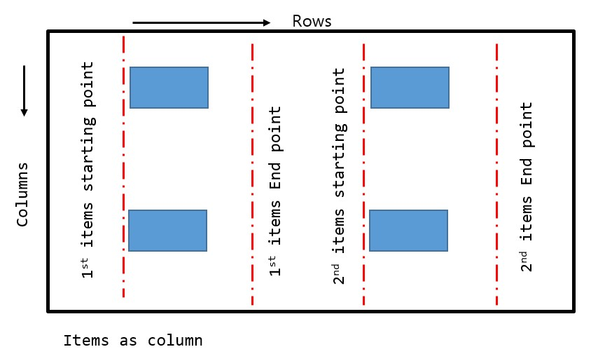

 # Justify Items
 সে নির্ধারণ করে আইটেমগুলো মেইন এক্সিস তথা রো বরাবর কি কিভাবে এ্যালাইন হবে।
## justify-items-start
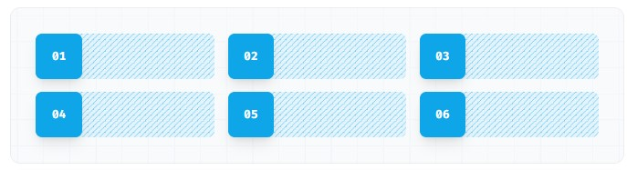

## justify-items-end
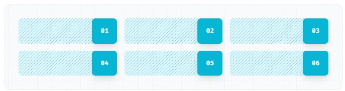

## justify-items-center	
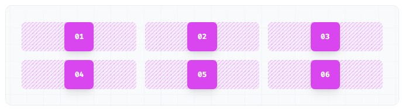

## justify-items-stretch
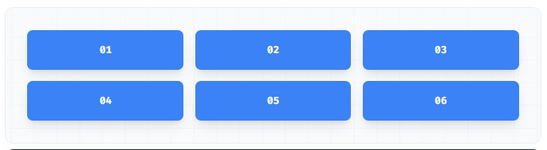

# Justify Self
সে নির্ধারণ করে আইটেমগুলোর থেকে যেকোন আইটেম ব্যক্তিগতভাবে মেইন এক্সিস তথা রো বরাবর কিভাবে এ্যালাইন হবে।

## justify-self-start
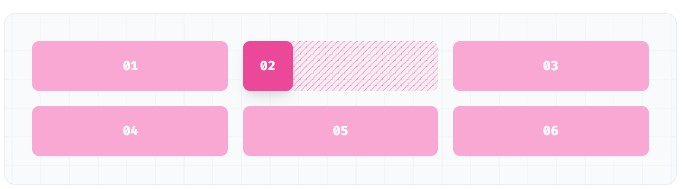

## justify-self-end
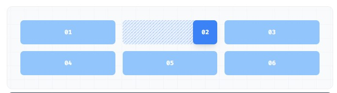	

## justify-self-center	
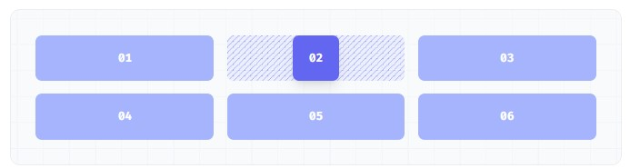

## justify-self-stretch
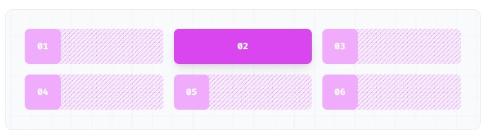

# What is align content?
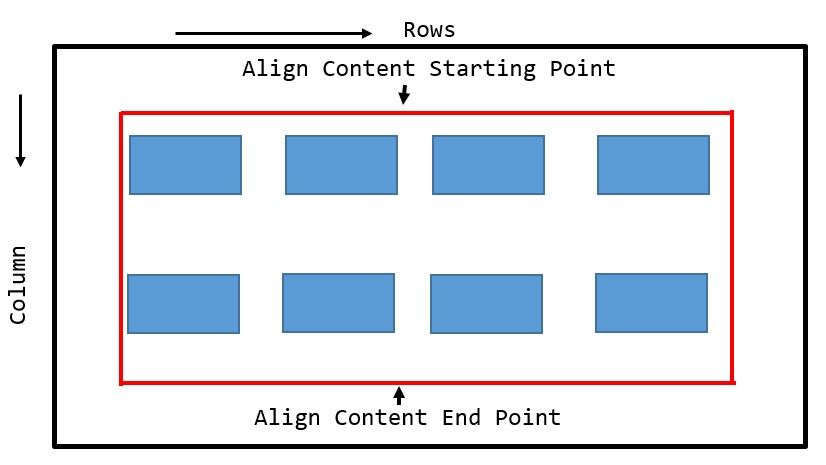

# Align Content
সে নির্ধারণ করে আইটেমগুলো ক্রস এক্সিস/কলাম বরাবর তথা উপর থেকে নিচের দিকে কিভাবে এ্যালাইন হবে। 
- কন্টেইনারের যে হাইট রয়েছে সে হাইট অনুযায়ী Statr, End, Center, Between and Evenly নির্ধারিত হয়। সুতরাং হাইট নির্ধারণ না করলে এ প্রপার্টি কাজ  করবেনা।  

## content-center
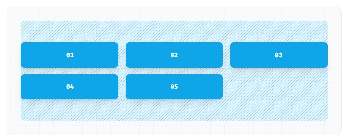

## content-start
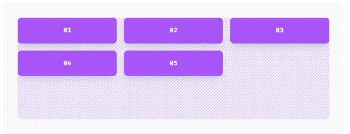

## content-end
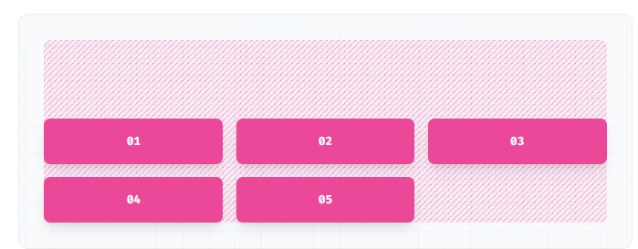

## content-between
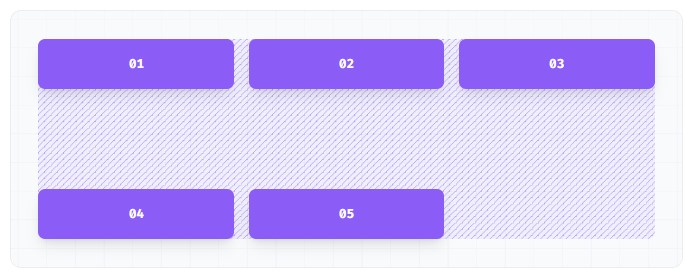

## content-around
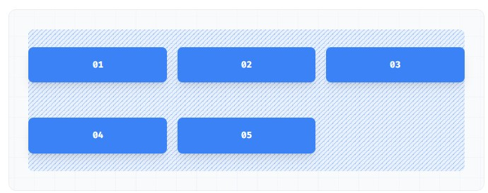

## content-evenly
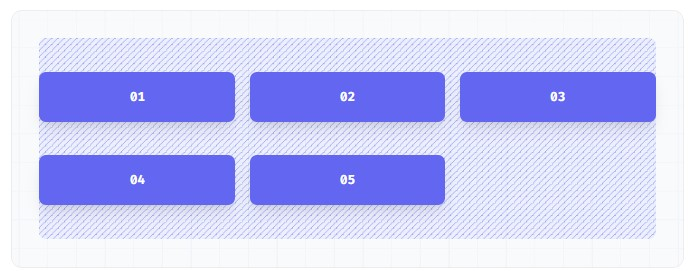

# Place Content
ইহা Content কে একসাথে রো এবং কলাম বরাবর justify এবং align করে।  
## place-content-center
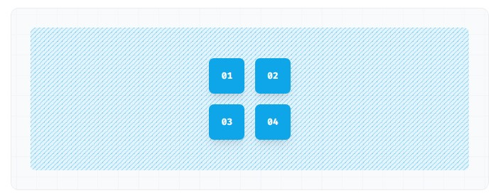

## place-content-start
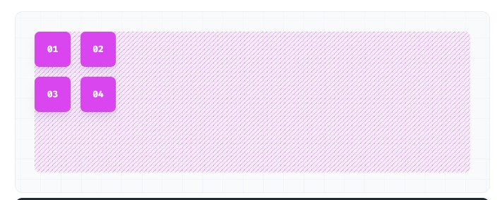

## place-content-end
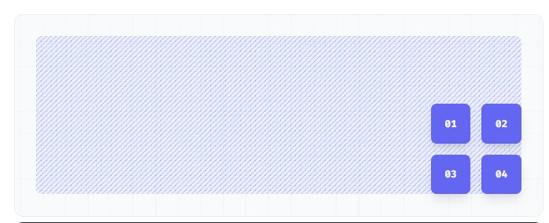

## place-content-between
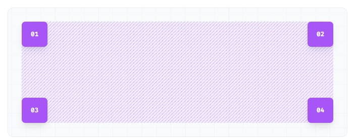

## place-content-around
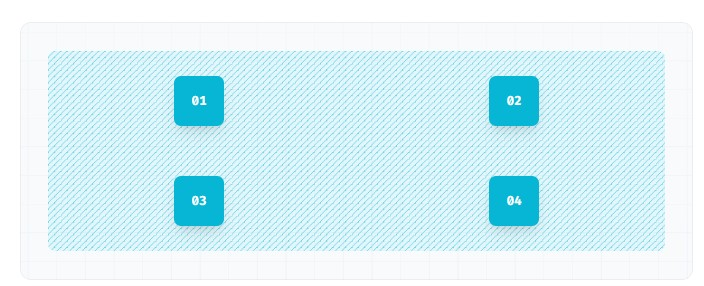

## place-content-evenly	
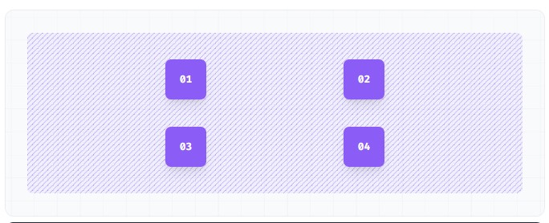

## place-content-stretch 
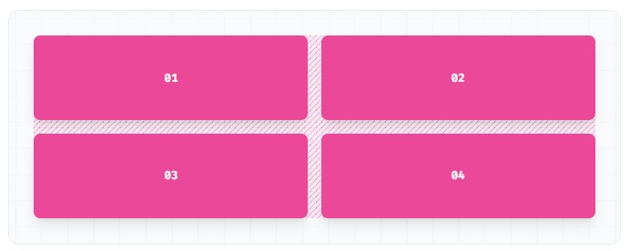

# Place items
ইহা items কে একসাথে রো এবং কলাম বরাবর justify এবং align করে। 
## place-items-start
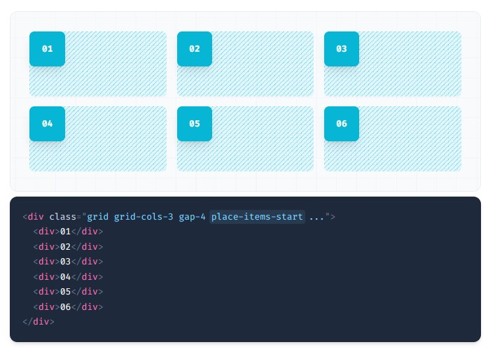

## place-items-end
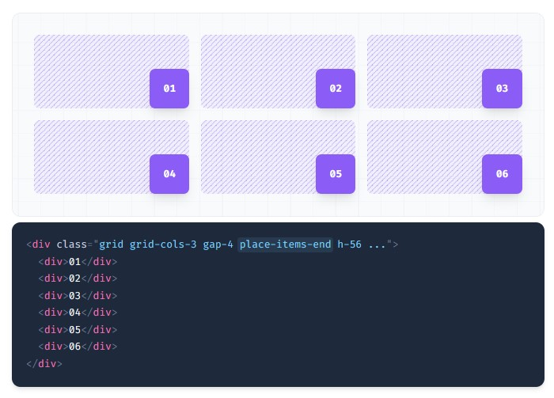

## place-items-center
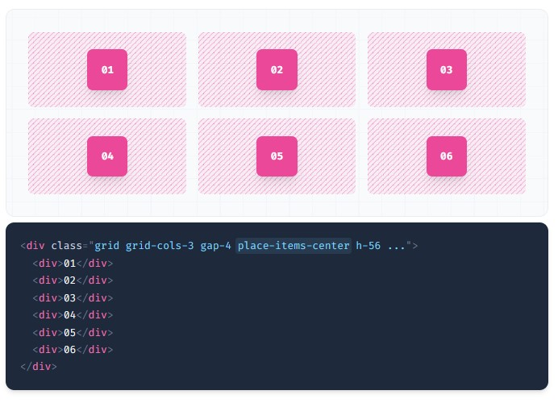

## place-items-stretch
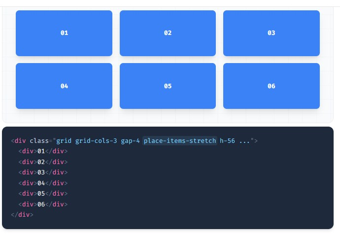

# place-self-items
ইহা item কে ব্যক্তিগতবাবে রো এবং কলাম বরাবর justify এবং align করে। 

## place-self-start	
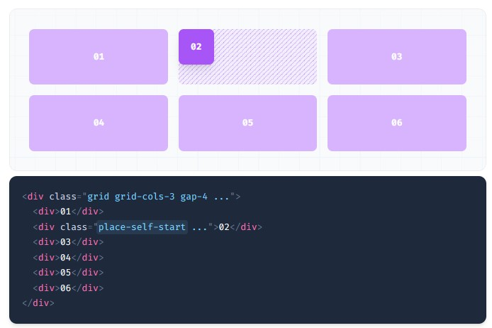

## place-self-end
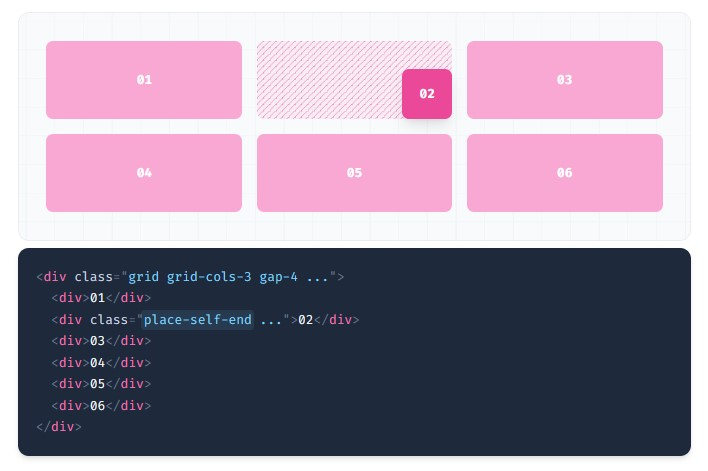

## place-self-center
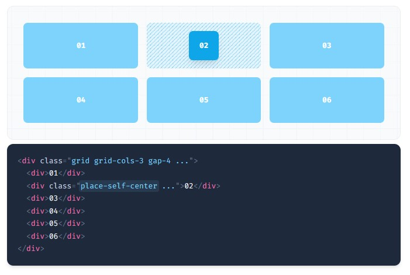

## place-self-stretch
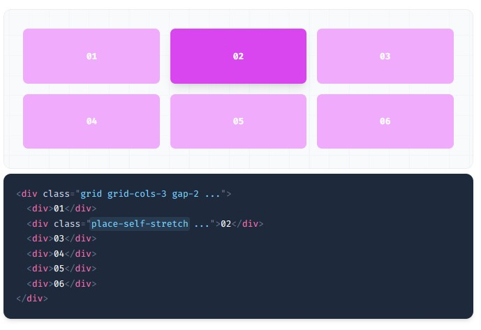
