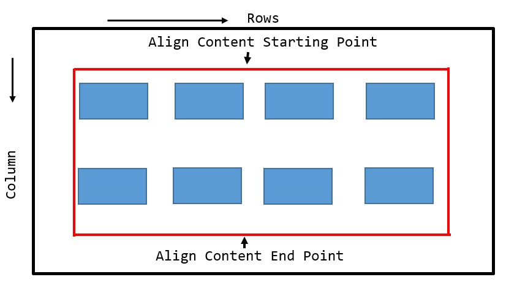

# Different between Flex & Grid system Layout
# Justify
ইহা কাজ করে মেইন এক্সিস তথা রো বরাবর । সুতরাং ওয়াইডথ নির্ধারণ না করলে ইহা কাজ করবেনা। 
Justify content  -> In flex  
Justify items     -> In grid  

## Justify content  -> In flex 

## Justify items     -> In grid

# Align
ইহা কজা করে ক্রস এক্সিস তথা কলাম বরাবর। সুতরাং হাইট নির্ধারণ না করলে ইহা কাজ করবেনা।   
Align item    -> In flex  
Align content -> In Grid 
Align content -> In flex   

## Align item    -> In flex

## Align content -> In Grid 

## Align content  -> In flex 
